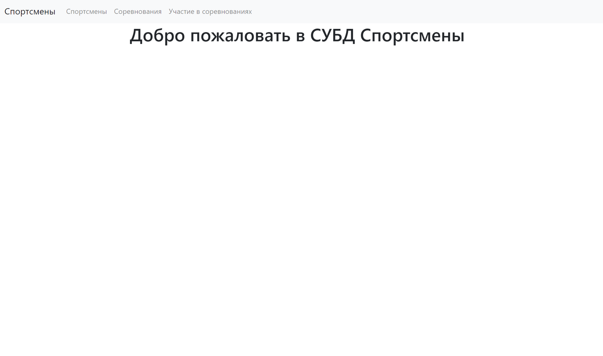
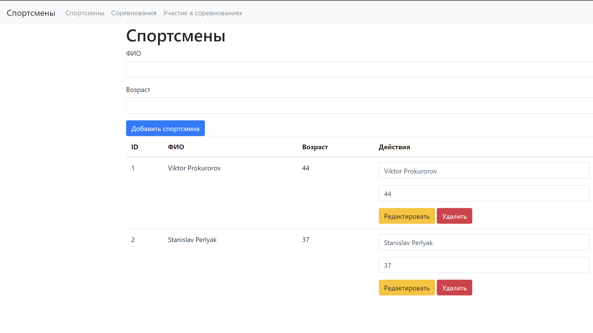
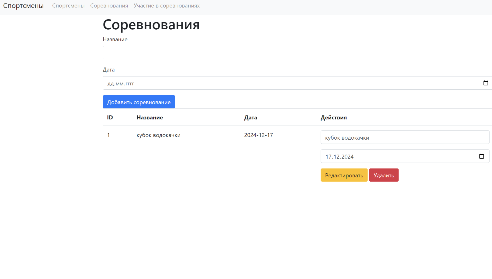
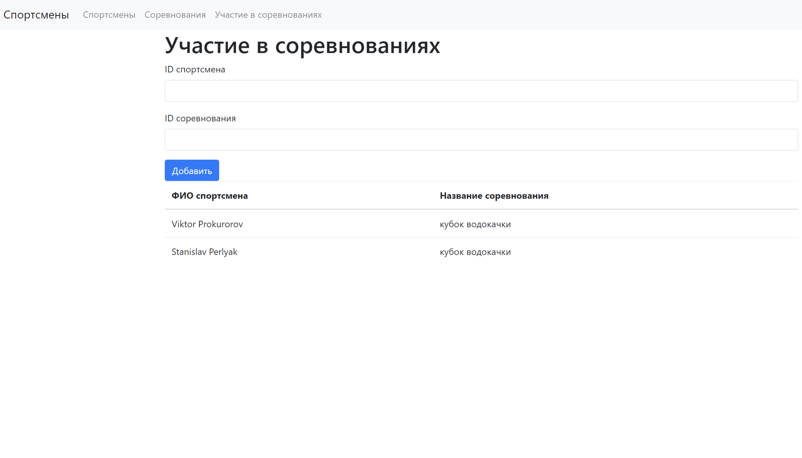

# СУБД Спортсмены
## Описание

Веб-программа 
Веб-приложение на основе Flask, которое позволяет просматривать информацию о спорсменах и соревнованиях, в которых они принимали участие. Состоит из 3 таблиц: 
спорсмены, соревнования, участие в соревнованиях.

